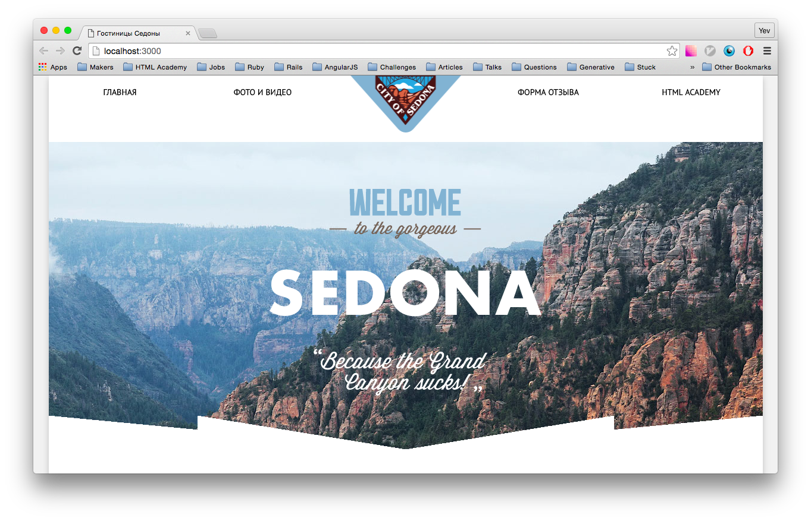
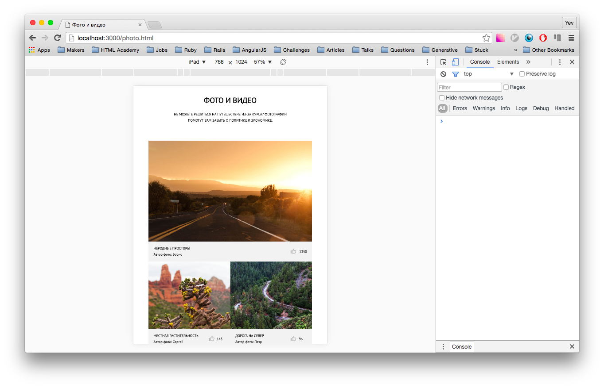
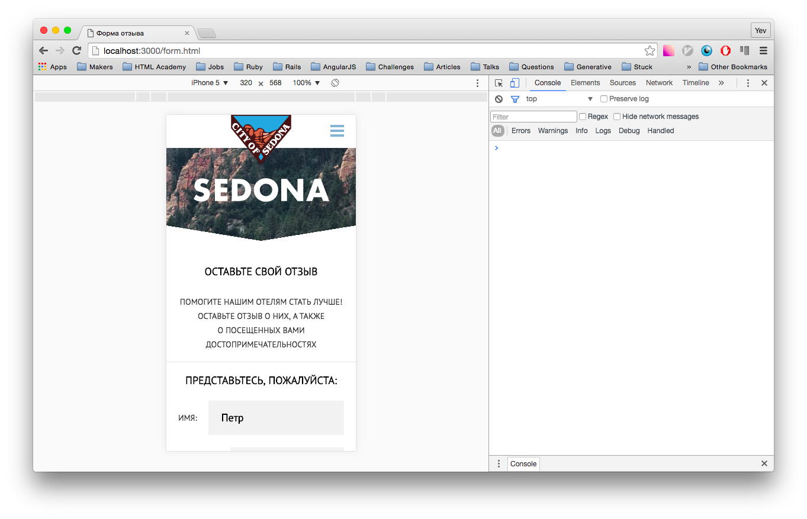

Sedona
======

A responsive website built using mobile-first design principles. It has one design for all screen resolution that can adapt to any size of screen - mobile, tablet and desktop.

Technologies used
-----------------

- HTML5, CSS3, JavaScript
- Optimizing graphics for Retina display
- Using SVG images
- Using BEM methodology
- Using preprocessor SASS
- Using task automation with Grunt
- Cross-browser support: Chrome, Firefox, Opera, Safari, Edge and IE11. and semantic tags

Prerequisites
-------------

Install Node.js with [NVM](https://github.com/creationix/nvm):

    $ nvm install node

Install the latest [NPM](https://www.npmjs.com/) globally:

    $ npm install -g npm

Then install Grunt globally using NPM:

    $ npm install -g grunt-cli

Setup
-----

Clone the repository:

    $ git clone git@github.com:yevdyko/sedona.git

Change into the directory:

    $ cd sedona

Install all dependencies with:

    $ npm install

How to use
----------

Build the optimized project using the command:

    $ npm run build

This create the optimized code for the project and puts it in the build folder

Run the optimized project from the build folder with:

    $ npm start

So now in your browser just go to [http://localhost:3000](http://localhost:3000)

Screenshots
-----------

